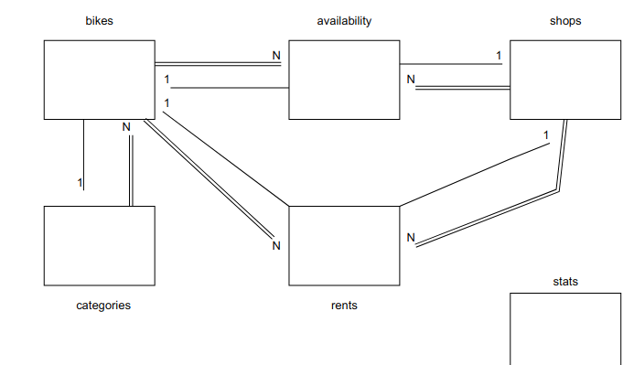
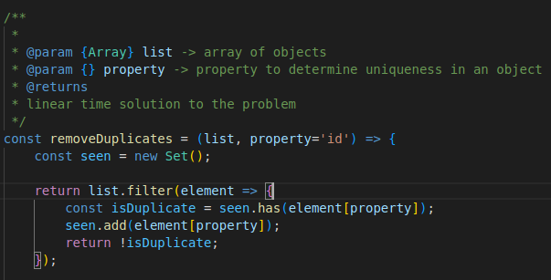
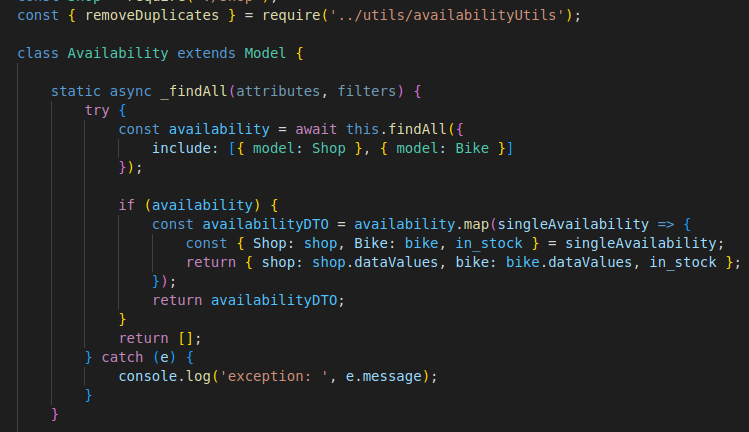
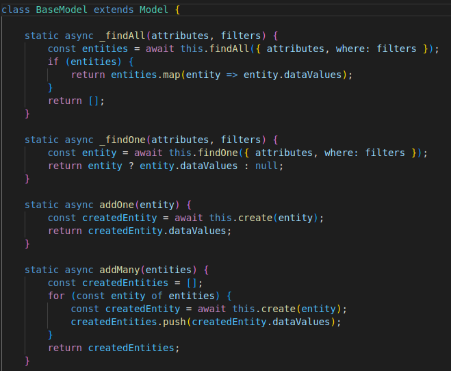
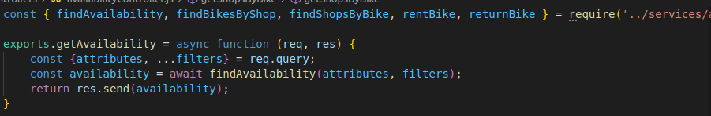
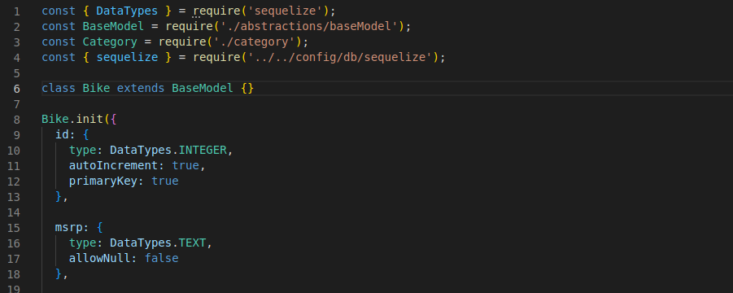

# BIKE-AGGREGATOR

### INTRO

This project is an API that pretends to act as a bike aggregator.

We have 4 entities in our system:

- Shop: The shops that are part of the aggregator

- Bike: The bikes that are rented

- Category: The category of the bike, which is related to subcategories hierarchically (self join)

- Availability: The association between the shops and the bikes they rent, with the stock available for renting


---

### ARCHITECTURE

This api follows a MVC architecture with some more components that decouple the system a little bit.

These other components are the services (in charge of business logic) and the repositories which are responsible of the data access.

Then we have a utils package to reuse some generic functions.

---

### DATA ABSTRACTION

There's a data abstraction that pretends to decouple the database from the system:

The repositories have a model parameter passed when they are created.

This model could be a Sequelize, Mongoose... 

The model has to implement the methods that the repository has in order to follow the abstraction. So, the Repository acts as an interface to be implemented by the models itself.

Then the model is an ES6 class that creates some static methods that are the ones called in its specific repository.

---

### DATABASE DETAILS

The database used is in this case mysql version 8 which is a docker container mounted with some volumes and initial scripts.

Then to get things simplified, Sequelize ORM is used only for the mapping between relational tables and models and to simplify the queries.

In the scripts folder, the schema.sql and data.sql are used to create the schema and some sample data (generated with chatGPT), and the test.sql do the same but is the script used by the testing database

https://sequelize.org/docs/v6/getting-started<br>
https://www.mysql.com/ <br>
https://hub.docker.com/_/mysql<br>

---

### ENVIRONMENTS

To manage different config variables, .env files are used, and there's a NODE_ENV variable setted in the npm scripts and then the .env files are loaded with a postfix of the value of this variable.

In the testing environment, a mysql container is used and is started with the command:

```bash
bash db-test.sh
```
Then with npm test, there are some npm scripts used calling the pretest, test and posttest.

A process manager is used (pm2) to start and stop the application in test mode, so in the unit and integration tests we don't need to manage the connection every time.

install it with the following command:

```bash
npm install pm2 -g
```
need to check if can be installed as a dev-dependency

---

### TESTING

I have used jest for the unit testing and supertest for integration testing and simulating the http requests.

Some useful resources:
- <a href="https://jestjs.io/docs/getting-started">jest</a>
- <a href="https://www.albertgao.xyz/2017/05/24/how-to-test-expressjs-with-jest-and-supertest/">jest and supertest</a>

Then, to prevent db from being modified when doing update, add or delete, have found a post on github 
that explains how to use transactions with jest and sequelize (need to investigate a little bit about it)

- https://github.com/sequelize/sequelize/issues/11408
- https://sequelize.org/docs/v6/other-topics/transactions/
- https://www.npmjs.com/package/cls-hooked
---

### DEPLOYMENT

There's a docker-compose.yaml that mounts the api image and the mysql image and communicates them
through a network and expose ports in the machine.

The api is mounted from the .dockerfile and the entrypoint is overriden to wait mysql to be ready and the execute the express api.

This task is done by using the dockerize service.

some resources:

- https://github.com/jwilder/dockerize
- https://millo-l.github.io/Synchronize-docker-compose-nodejs-mysql-execution-order/
- https://github.com/Mohammad-Faisal/professional-express-sequelize-docker-boilerplate

---

### ES6 FEATURES: 

##### Array manipulation with filter and use of Set object



used in availability utils to remove duplicates, also use default param in function

##### Array manipulation with map and destructuring to rename properties and copy values



used in availability model to present model data and hide sequelize details

##### ES6 classes and more array manipulation



to extend it after from a concrete model and to manipulate array data extracted from DB

##### Destructuring to get request parameters



to get an specific request param by its name and to get the rest of params with spread operator

##### Class inheritance with ES6



to inherit the base model and reuse its functions

---

### TODO:

- [ ] Try to work with mongoDB to test if the data-access abstraction works fine

- [ ] Improve transactional tests

- [ ] Do better business use-cases and make use of services layer properly
      ex: (add bike and associate to a given shop, quit a bike from a given shop, update stock, add price of renting...)

- [ ] Add more Integration tests

- [ ] Handle data with middlewares and normalize responses

- [ ] Embedded postman collection


